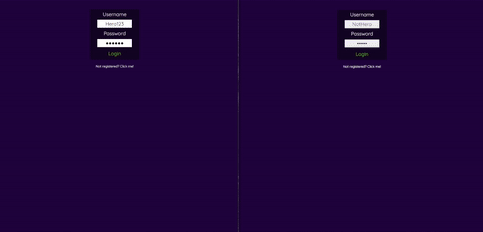

To audit the program, find the steps [here](https://github.com/01-edu/public/tree/master/subjects/real-time-forum/audit)

# Real Time Forum

## Project Description

Real Time Forum stack:

Frontend: HTML, CSS, Vanilla JS

Backend: Golang

Database: SQLite

Place where you can create posts with categories, comment the posts and have Live chat with other users or just send them messages if they are online/offline.

## Screenshots

Here's a Gif of the project:



## How to Run the Project

Open first terminal

```bash
git clone https://01.kood.tech/git/jsaar/real-time-forum
cd real-time-forum
cd backend
go get
go run .
```

Open second terminal

```bash
cd frontend
npm install
npm run dev
```

Note: Frontend is currently run by webpack, intention is to build the package and host it with NGINX as a container or just static site. It's left as a dev build for auditing purposes.

_<sup>Author: [Jaanus Saar](https://01.kood.tech/git/jsaar)_</sup>
